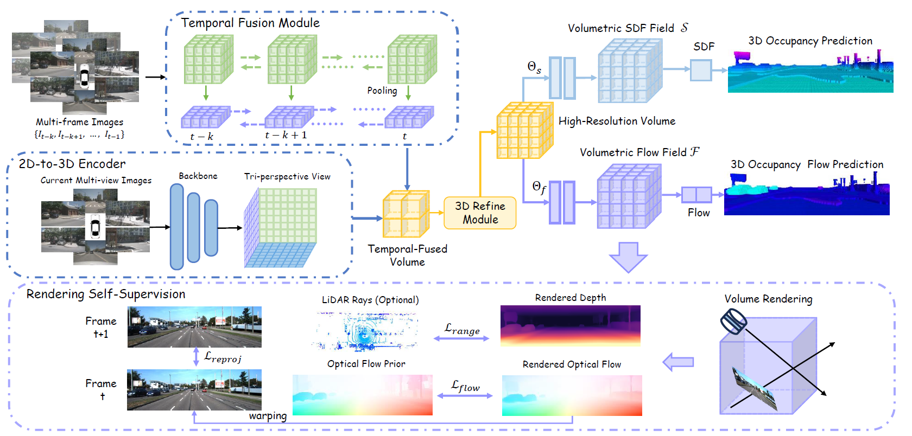

# Let Occ Flow: Self-Supervised 3D Occupancy Flow Prediction
### [Paper](https://arxiv.org/pdf/2407.07587)  | [Project Page](https://eliliu2233.github.io/letoccflow/) 

> Let Occ Flow: Self-Supervised 3D Occupancy Flow Prediction, CoRL 2024

> [Yili Liu](https://scholar.google.com/citations?user=pBEZ7V4AAAAJ&hl=zh-CN)\*, [Linzhan Mou](https://scholar.google.com/citations?user=cIXq7Z4AAAAJ&hl=en)\*, [Xuan Yu](https://scholar.google.com/citations?hl=zh-CN&user=4Ry3CKsAAAAJ), Chenrui Han, [Sitong Mao](https://scholar.google.com/citations?user=RiX5SJUAAAAJ&hl=zh-CN&oi=sra), [Rong Xiong](https://scholar.google.com/citations?user=1hI9bqUAAAAJ&hl=en), [Yue Wang](https://ywang-zju.github.io/)$\dagger$

\* Equal contribution  $\dagger$ Corresponding author

# Update
- **[2025/04/16]** - Code released.
- **[2024/09/04]** - Our paper has been accepted to CoRL 2024. We will release the code in this repository.
- **[2024/07/18]** - We released our paper on [arXiv](https://arxiv.org/abs/2407.07587).

# Demo

### Results on KITTI-MOT dataset:


### Results on nuScenes dataset:


# Introduction



- We proposed Let Occ Flow, the first self-supervised method for jointly predicting 3D occupancy and occupancy flow, by integrating 2D optical flow cues into geometry and motion optimization.
- We designed a novel attention-based temporal fusion module for efficient temporal interaction. Furthermore, we proposed a flow-oriented optimization strategy to mitigate the training instability and sample imbalance problem.
- We conducted extensive experiments on various datasets with qualitative and quantitative analyses
to show the competitive performance of our approach.

## Getting Started

### Installation
Follow detailed instructions in [Installation](docs/installation.md).

### Preparing Dataset
Follow detailed instructions in [Prepare Dataset](docs/prepare_data.md).

### Train

```shell
# kitti odometry(tab.1)
# train occ model
python train.py --py-config config/kitti/kitti_occ_odom.py --work-dir out/train/kitti/occ_odom --dataset kitti --depth-metric 

# nuscenes(tab.3)
# train occ model
python train.py --py-config config/nuscenes/nuscenes_occ_voxelaffm.py --work-dir out/train/nuscenes/occ_static_train --dataset nuscenes --depth-metric

# train occ flow model (modify the parameter 'load_from' in the config file)
python train.py --py-config config/nuscenes/nuscenes_occ_flow_voxelaffm.py --work-dir out/train/nuscenes/occ_flow_train --dataset nuscenes --depth-metric 
```

### Evaluation and Visualization

```shell
# save occupancy, occupancy flow and render results
# (modify the parameter 'load_from' in the config file)
python eval.py --py-config config/kitti/kitti_occ_odom.py --work-dir out/visualization/kitti/kitti_odom --resolution 0.2 --dataset kitti

python eval.py --py-config config/nuscenes/nuscenes_occ_flow_voxelaffm.py --work-dir out/visualization/nuscenes/occ_flow --resolution 0.4 --dataset nuscenes

# prepare ray casting for ray_iou_geo metric
python utils/ray_iou_geo/ray_casting_kitti.py --pred-occ-path out/visualization/nuscenes/kitti/kitti_odom --output-dir /path/to/project/ray_iou_output/kitti_odom

python utils/ray_iou_geo/ray_casting_nus.py --pred-occ-path out/visualization/nuscenes/occ_flow/occupancy --output-dir /path/to/project/ray_iou_output/occ_flow

# eval ray_iou_geo metric
python utils/ray_iou_geo/metric_kitti.py --work-dir /path/to/project/ray_iou_output/kitti_odom

python utils/ray_iou_geo/metric.py --work-dir /path/to/project/ray_iou_output/occ_flow

# visualize occupancy and occupancy flow
python visualize_occupancy_kitti.py
python visualize_occupancy.py

```
# Acknowledgement

Many thanks to these excellent projects.
+ [SelfOcc](https://github.com/huang-yh/SelfOcc)
+ [OccNeRF](https://github.com/LinShan-Bin/OccNeRF)
+ [OccNet](https://github.com/OpenDriveLab/OccNet)
+ [Unimatch](https://github.com/autonomousvision/unimatch)
+ [Cotracker](https://github.com/facebookresearch/co-tracker)

# Citation
If this work is helpful for your research, please consider citing the following paper:
```
@article{liu2024letoccflow,
    title={Let Occ Flow: Self-Supervised 3D Occupancy Flow Prediction},
    author={Yili Liu and Linzhan Mou and Xuan Yu and Chenrui Han and Sitong Mao and Rong Xiong and Yue Wang},
    journal={arXiv preprint arXiv:2407.07587},
    year={2024},
}
```
